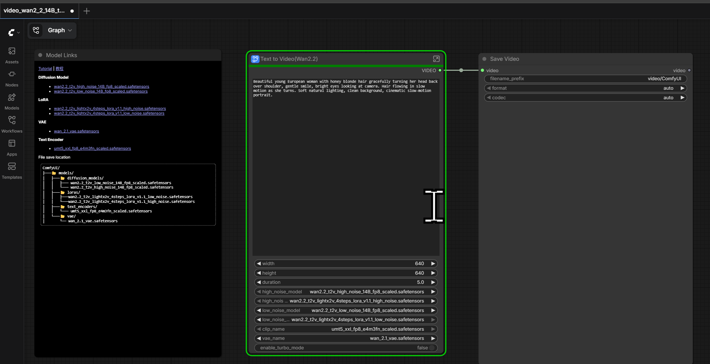
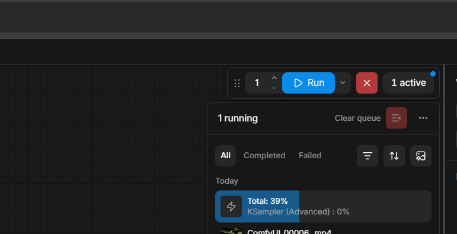

# ComfyUI Deployment & Wan 2.2 Text-to-Video Tutorial (AMD W7900 · ROCm)

Install ComfyUI on an AMD GPU (ROCm) server and run the official **Wan 2.2 14B Text-to-Video** example. Reference: https://docs.comfy.org/tutorials/video/wan/wan2_2

> Environment: Ubuntu 24.04 + ROCm 7.2.4 + PyTorch 2.10 (HIP) + AMD **W7900 / gfx1100 (48GB VRAM)** + ComfyUI 0.25.0

---

## 0. Prerequisites

- A Linux host with **AMD GPU + ROCm driver + Docker** installed.
- Base image: Official ROCm PyTorch (includes PyTorch with ROCm support): `rocm/pytorch:rocm7.2.4_ubuntu22.04_py3.10_pytorch_release_2.10.0`

Configure PyPI mirror (optional):

```bash
pip config set global.index-url https://mirrors.aliyun.com/pypi/simple/
pip config set global.trusted-host mirrors.aliyun.com
```

---

## 1. Install ComfyUI (skip if already installed)

Clone ComfyUI source in your ROCm PyTorch environment:

```bash
git clone https://github.com/comfyanonymous/ComfyUI.git
cd ComfyUI
```

Install dependencies, **excluding the torch packages** to preserve ROCm PyTorch:

```bash
pip install $(grep -viE '^(torch|torchvision|torchaudio)\s*$' requirements.txt)
```

Wan 2.2 nodes are built into recent ComfyUI versions; no custom nodes needed.

> This tutorial uses pre-built image **`comfyui_zihaomu:ready`** with everything configured; just run it directly.

---

## 2. Download Models and Place in Correct Directories

Total **6 files** (fp8-quantized, runs on 48GB single card):

| Type | Filename | Directory | Size |
|------|----------|-----------|------|
| Diffusion Model (high-noise) | wan2.2_t2v_high_noise_14B_fp8_scaled.safetensors | models/diffusion_models/ | 14GB |
| Diffusion Model (low-noise) | wan2.2_t2v_low_noise_14B_fp8_scaled.safetensors | models/diffusion_models/ | 14GB |
| Text Encoder | umt5_xxl_fp8_e4m3fn_scaled.safetensors | models/text_encoders/ | 6.3GB |
| VAE | wan_2.1_vae.safetensors | models/vae/ | 243MB |
| Acceleration LoRA (high-noise) | wan2.2_t2v_lightx2v_4steps_lora_v1.1_high_noise.safetensors | models/loras/ | 1.2GB |
| Acceleration LoRA (low-noise) | wan2.2_t2v_lightx2v_4steps_lora_v1.1_low_noise.safetensors | models/loras/ | 1.2GB |

Directory structure:

```
ComfyUI/models/
├── diffusion_models/   wan2.2_t2v_high_noise_14B_fp8_scaled.safetensors
│                       wan2.2_t2v_low_noise_14B_fp8_scaled.safetensors
├── text_encoders/      umt5_xxl_fp8_e4m3fn_scaled.safetensors
├── vae/                wan_2.1_vae.safetensors
└── loras/              wan2.2_t2v_lightx2v_4steps_lora_v1.1_high_noise.safetensors
                        wan2.2_t2v_lightx2v_4steps_lora_v1.1_low_noise.safetensors
```

Download using `hf` CLI (use mirror if direct access fails by setting `HF_ENDPOINT`). Diffusion models/VAE/LoRA are in `Comfy-Org/Wan_2.2_ComfyUI_Repackaged`, text encoder in `Comfy-Org/Wan_2.1_ComfyUI_repackaged`:

```bash
export HF_ENDPOINT=https://hf-mirror.com
REPO=Comfy-Org/Wan_2.2_ComfyUI_Repackaged

hf download $REPO split_files/diffusion_models/wan2.2_t2v_high_noise_14B_fp8_scaled.safetensors --local-dir ./_stage
hf download $REPO split_files/diffusion_models/wan2.2_t2v_low_noise_14B_fp8_scaled.safetensors  --local-dir ./_stage
hf download $REPO split_files/vae/wan_2.1_vae.safetensors                --local-dir ./_stage
hf download $REPO split_files/loras/wan2.2_t2v_lightx2v_4steps_lora_v1.1_high_noise.safetensors --local-dir ./_stage
hf download $REPO split_files/loras/wan2.2_t2v_lightx2v_4steps_lora_v1.1_low_noise.safetensors  --local-dir ./_stage
hf download Comfy-Org/Wan_2.1_ComfyUI_repackaged \
  split_files/text_encoders/umt5_xxl_fp8_e4m3fn_scaled.safetensors --local-dir ./_stage
```

Files download to `_stage/split_files/...`; move them to the corresponding `models/<type>/` directories per the table above (removing the `split_files/` layer).

---

## 3. Prepare Workflow

This directory includes workflow file **`video_wan2_2_14B_t2v_fast.json`** (640×640, 81 frames, lightx2v 4-step fast path).

Video length formula: `frames = floor(Duration × FPS) + 1` (default 5×16+1 = 81 frames). Adjust **Duration** to change length; use whole seconds with FPS=16 for stability (Wan VAE requires frames ≡ 1 mod 4).

---

## 4. Start ComfyUI and Run

Start the pre-configured container image:

```bash
docker run -d --name comfyui_zihaomu_video --restart unless-stopped \
  -p 26687:8888 \
  -v /path/to/comfyui_workspace:/comfyui_workspace \
  --device=/dev/kfd --device=/dev/dri \
  comfyui_zihaomu:ready
```

After startup, open **`http://<server-ip>:26687`** in your browser to access ComfyUI.

In the Web UI: Drag `video_wan2_2_14B_t2v_fast.json` **into the canvas** → Click **Run**.

Workflow overview:



Execution progress:



Output video saved in `ComfyUI/output/video/`; example result:

📹 [output_video.mp4](data/output_video.mp4) (640×640, 16fps, ~5 seconds)

> For remote access: if the UI lags or progress doesn't display, it's usually a network issue between browser and server; the task continues server-side. Use `ssh -L 26687:127.0.0.1:26687 <user>@<server-ip>` for port forwarding, then access `http://127.0.0.1:26687`.

---

## Expected Results

Single **W7900 (48GB)** with lightx2v 4-step acceleration: **~6 minutes** per video (640×640, 81 frames). Peak VRAM usage ~40GB.

> Measured on AMD W7900 · ROCm 7.2.4 · ComfyUI 0.25.0
## References

- ComfyUI Official Wan 2.2 Tutorial: https://docs.comfy.org/tutorials/video/wan/wan2_2
- Model Repository: https://huggingface.co/Comfy-Org/Wan_2.2_ComfyUI_Repackaged
- ComfyUI Source: https://github.com/comfyanonymous/ComfyUI
